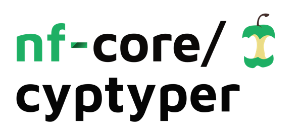

<h1>
  <picture>
    <source media="(prefers-color-scheme: dark)" srcset="docs/images/nf-core-cyptyper_logo_dark.png">
    
  </picture>
</h1>

[](https://github.com/nf-core/cyptyper/actions/workflows/nf-test.yml)
[](https://github.com/nf-core/cyptyper/actions/workflows/linting.yml)[](https://nf-co.re/cyptyper/results)[](https://doi.org/10.5281/zenodo.XXXXXXX)
[](https://www.nf-test.com)

[](https://www.nextflow.io/)
[](https://github.com/nf-core/tools/releases/tag/3.3.2)
[](https://docs.conda.io/en/latest/)
[](https://www.docker.com/)
[](https://sylabs.io/docs/)
[](https://cloud.seqera.io/launch?pipeline=https://github.com/nf-core/cyptyper)

[](https://nfcore.slack.com/channels/cyptyper)[](https://bsky.app/profile/nf-co.re)[](https://mstdn.science/@nf_core)[](https://www.youtube.com/c/nf-core)

## Introduction

**nf-core/cyptyper** is a bioinformatics pipeline that ...

## Default Workflow Steps

The CYPTYPER pipeline is composed of the following core stages:

1. **FASTQC** – Quality control of raw FASTQ files
2. **PREPARE_REFERENCE_INDEXES** – Generation of reference indexes and supporting files
3. **FASTQ_ALIGN_BWA** – Alignment of reads to the reference genome using BWA
4. **BAM_STATS_BEDTOOLS_DEPTH** – Calculation of BAM statistics and depth metrics
5. **VARIANT_CALLING** – Detection of genomic variants using Clair3, Longshot, and GATK4
6. **VARIANT_ANNOTATION** – Annotation of variants using PyPGx and PANNO
7. **MULTIQC** – Aggregation of results and generation of a final summary report

---

### 1. 🔬 FASTQC

Performs quality control checks on raw sequencing reads using [FastQC](https://www.bioinformatics.babraham.ac.uk/projects/fastqc/).  
GitHub: [https://github.com/s-andrews/FastQC](https://github.com/s-andrews/FastQC)

### 2. 🧬 PREPARE_REFERENCE_INDEXES

Generates all necessary reference files required for downstream analysis:

- BWA index using [BWA](http://bio-bwa.sourceforge.net/)
- Sequence dictionary via [GATK](https://gatk.broadinstitute.org/)
- FASTA index using [Samtools](http://www.htslib.org/)
- STR table for DragSTR modeling ([DragSTR GitHub](https://github.com/Illumina/DragSTR))
- Clair3 model download ([Clair3 GitHub](https://github.com/HKU-BAL/Clair3))
- PyPGx bundle download ([PyPGx GitHub](https://github.com/PGxCenter/pypgx))
- dbSNP indexing with [Tabix](http://www.htslib.org/doc/tabix.html)

### 3. 🧬 FASTQ_ALIGN_BWA

Aligns sequencing reads to the reference genome using [BWA-MEM](http://bio-bwa.sourceforge.net/). Post-alignment processing includes:

- `samtools sort`: Sorts BAM files by coordinate
- `samtools index`: Indexes BAM files for random access
- `samtools stats`: Generates detailed alignment statistics
- `samtools flagstat`: Summarizes alignment flags (e.g., mapped/unmapped reads)
- `samtools idxstats`: Reports per-reference mapping statistics

### 4. 📊 BAM_STATS_BEDTOOLS_DEPTH

Calculates coverage and depth metrics across target regions using:

- `bedtools genomecov`: Computes genome-wide coverage statistics ([BEDTools](https://bedtools.readthedocs.io/))
- `samtools depth`: Computes per-base read depth
- `samtools average_depth`: Calculates average depth across specified regions

### 5. 🧬 VARIANT_CALLING

Identifies genomic variants using a combination of tools:

- [Clair3](https://github.com/HKU-BAL/Clair3): Deep-learning-based variant caller optimized for long-read sequencing
- [Longshot](https://github.com/pjedge/longshot): Accurate variant caller for long-read data
- [GATK4](https://gatk.broadinstitute.org/): Industry-standard toolkit for variant discovery and genotyping, using the following modules:
  - `AddOrReplaceReadGroups`
  - `MarkDuplicates`
  - `CalibrateDragstrModel`
  - `HaplotypeCaller`
- [BCFtools](https://github.com/samtools/bcftools): Suite of tools for manipulating VCF/BCF files:
  - `concat`: Concatenates multiple VCF files
  - `norm`: Normalizes variant representations
  - `sort`: Sorts VCF records
  - `annotate`: Adds annotations to VCF entries
  - `filter`: Applies filtering criteria to variants
- Custom VCF header generation for compatibility with downstream annotation tools

### 6. 🧬 VARIANT_ANNOTATION

Annotates detected variants using:

- [PANNO](https://github.com/PGxCenter/panno): Pharmacogenomic annotation tool
- PyPGx pipelines for long-read and NGS data ([PyPGx GitHub](https://github.com/PGxCenter/pypgx))
- Merging of annotation results and CYP2D6-specific data

### 7. 📊 MULTIQC

Compiles all quality control metrics, software versions, parameter summaries, and method descriptions into a final interactive report using [MultiQC](https://multiqc.info/)  
GitHub: [https://github.com/ewels/MultiQC](https://github.com/ewels/MultiQC)

> [!Note]
> Each of the above steps is executed by default. PANNO and PyPGx annotations may be skipped if input VCFs do not meet the required thresholds for genotyping.

## Usage

> [!NOTE]
> If you are new to Nextflow and nf-core, please refer to [this page](https://nf-co.re/docs/usage/installation) on how to set-up Nextflow. Make sure to [test your setup](https://nf-co.re/docs/usage/introduction#how-to-run-a-pipeline) with `-profile test` before running the workflow on actual data.

## Preparing Input Data

This pipeline is built and tested using Oxford Nanopore Technologies (ONT) data, which typically consists of **single-end** FASTQ files. However, it is compatible with other sequencing platforms, including those that produce **paired-end** reads (e.g., Illumina).

To run the pipeline, you must first prepare a samplesheet that specifies your input data. The format of the samplesheet depends on whether your data is single-end or paired-end.

### 🧬 Single-End Example (ONT)

`samplesheet.csv`:

```csv
sample,fastq_1
ONT_SAMPLE_01,ONT_SAMPLE_01.fastq.gz
ONT_SAMPLE_02,ONT_SAMPLE_02.fastq.gz
```

Each row represents a single-end FASTQ file. The `fastq_1` column is required; `fastq_2` should be omitted.

### 🧬 Paired-End Example (Illumina or others)

`samplesheet.csv`:

```csv
sample,fastq_1,fastq_2
ILLUMINA_SAMPLE_01,SAMPLE_01_R1.fastq.gz,SAMPLE_01_R2.fastq.gz
ILLUMINA_SAMPLE_02,SAMPLE_02_R1.fastq.gz,SAMPLE_02_R2.fastq.gz
```

Each row represents a pair of FASTQ files corresponding to forward (`fastq_1`) and reverse (`fastq_2`) reads.

> ⚙️ **Note:** Mapping behavior (e.g., aligner parameters) may vary depending on the sequencing platform. You should modify the alignment module configuration (`conf/modules.config`) using `ext.args` or provide a options specific to your sequencing platform, such as:
>
> - `bwa mem -x <ont2d/intractg/pacbio>` for Oxford Nanopore, Illumina, and PacBio, respectively.
> - Read length thresholds
> - Quality trimming settings
> - Platform-specific variant calling filters
>
> These options can be provided in a separate config using the `-c config` option when running the pipeline.

For more details on customizing configuration profiles, see the [nf-core documentation](https://nf-co.re/docs/usage/configuration).

Once your samplesheet is ready, run the pipeline using:

```bash
nextflow run nf-core/cyptyper \
   -profile <docker/singularity/conda/.../institute> \
   --input samplesheet.csv \
   --outdir <OUTDIR>
```

> 🧠 Tip: This pipeline is heavily tested on `conda` even though other profiles are supported.

> [!WARNING]
> Please provide pipeline parameters via the CLI or Nextflow `-params-file` option. Custom config files including those provided by the `-c` Nextflow option can be used to provide any configuration _**except for parameters**_; see [docs](https://nf-co.re/docs/usage/getting_started/configuration#custom-configuration-files).

For more details and further functionality, please refer to the [usage documentation](https://nf-co.re/cyptyper/usage) and the [parameter documentation](https://nf-co.re/cyptyper/parameters).

## Pipeline output

To see the results of an example test run with a full size dataset refer to the [results](https://nf-co.re/cyptyper/results) tab on the nf-core website pipeline page.
For more details about the output files and reports, please refer to the
[output documentation](https://nf-co.re/cyptyper/output).

## Credits

nf-core/cyptyper was originally written by [Fredrick Mobegi](https://github.com/fmobegi) at the Department of Clinical Immunology, [PathWest Laboratory Medicine WA](https://pathwest.health.wa.gov.au/).

Maintenance and future developements will be led by Fredrick Mobegi.

<p float="center">
  
  
</p>

<!-- TODO We thank the following people for their extensive assistance in the development of this pipeline:

<!-- TODO nf-core: If applicable, make list of people who have also contributed -->

## Contributions and Support

If you would like to contribute to this pipeline, please see the [contributing guidelines](.github/CONTRIBUTING.md).

For further information or help, don't hesitate to get in touch on the [Slack `#cyptyper` channel](https://nfcore.slack.com/channels/cyptyper) (you can join with [this invite](https://nf-co.re/join/slack)).

## Citations

<!-- TODO nf-core: Add citation for pipeline after first release. Uncomment lines below and update Zenodo doi and badge at the top of this file. -->
<!-- If you use nf-core/cyptyper for your analysis, please cite it using the following doi: [10.5281/zenodo.XXXXXX](https://doi.org/10.5281/zenodo.XXXXXX) -->

<!-- TODO nf-core: Add bibliography of tools and data used in your pipeline -->

An extensive list of references for the tools used by the pipeline can be found in the [`CITATIONS.md`](CITATIONS.md) file.

You can cite the `nf-core` publication as follows:

> **The nf-core framework for community-curated bioinformatics pipelines.**
>
> Philip Ewels, Alexander Peltzer, Sven Fillinger, Harshil Patel, Johannes Alneberg, Andreas Wilm, Maxime Ulysse Garcia, Paolo Di Tommaso & Sven Nahnsen.
>
> _Nat Biotechnol._ 2020 Feb 13. doi: [10.1038/s41587-020-0439-x](https://dx.doi.org/10.1038/s41587-020-0439-x).
